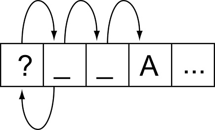

# random-iterator

This little component allows to randomly iterate over an array using iterators and generators.

Current version: **1.0.0**

Lead Maintainer: [Halim Qarroum](mailto:hqm.post@gmail.com)

## Iterator interface

To use an iterator instance to walk through the array, you can use the `RandomIterator` interface.

```Javascript
var array    = [1, 2, 5, 6, 10, 20, 25];
var iterator = new RandomIterator(array);

while (iterator.hasNext()) {
  // Displays the value located at a
  // random index of the array.
  console.log(iterator.next());
}
```

It is guaranteed that each value will only be returned once by `.next`, and that it will return an undefined value once every values of the array have been returned.

## Generator interface

If you'd like to use a function to iterate randomly over the array, you can generate one using `random_generator`.

```Javascript
var array = [1, 2, 5, 6, 10, 20, 25];
var next  = random_generator(array);

for (var value; value = next();) {
  console.log(value);
}
```
